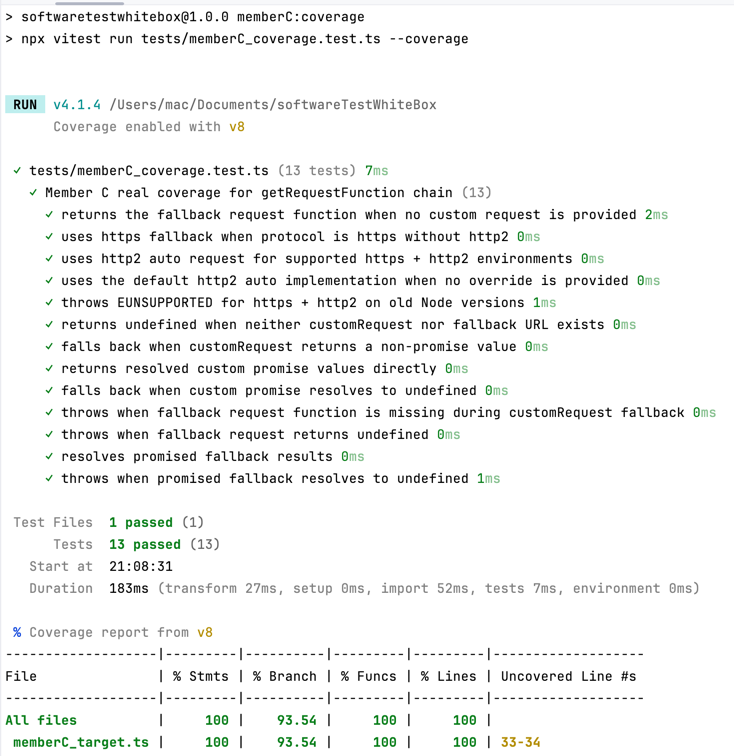

# 基于大语言模型（LLM）的自动化白盒测试工具链实验项目报告

## 第一部分：项目背景与探索

### 1. 行业现状与痛点
在软件质量保障领域，**白盒测试**是确保代码逻辑严密性的核心，但在现代大型工程（如 Node.js 的开源库）中，它面临着严峻挑战：
* **逻辑高度复杂**：代码中充斥着异步 Promise、闭包调度以及针对不同运行环境（如 Node 版本兼容性）的防御式分支。
* **Mock 成本极高**：手动编写测试用例时，开发者需花费大量时间通过“黑盒”猜测来构造复杂的内部状态（如 `this.#internals`）。
* **自动化程度不足**：传统的自动化工具通常只能做到“测量”，而无法做到“生成”，导致测试补全工作严重依赖高阶工程师的经验。

### 2. 项目目标与核心价值
本项目旨在利用 **LLM（大语言模型）** 的逻辑推理能力，构建一套端到端的**自动化白盒测试工具链**。其核心价值在于：
1. AI 自动解析控制流并生成满足覆盖率要求的输入参数。
2. 通过物理执行引擎（Vitest）与覆盖率审计（V8）对 AI 生成的结果进行硬性校验。
3. 将原本需要数小时的复杂函数白盒分析缩短至秒级生成。

---


## 第二部分：白盒测试设计

### 1. 被测对象深度剖析
本实验选取知名开源库 **Got**作为研究对象。我们聚焦于其最核心、最复杂的代码块：`source/core/options.ts` 中的请求调度逻辑。

- **主测函数**：`Options.getRequestFunction`。
- **核心逻辑挑战**：该函数并非简单的线性代码，而是一个根据环境动态返回“请求执行器”的工厂方法。它涉及：
    * **异步闭包**：返回的函数内部嵌套了异步 Promise 逻辑。
    * **多层级回退（Fallback）机制**：当 `customRequest` 为 `undefined` 或执行失败时，必须平滑回退到 Node.js 原生模块。
    * **环境依赖**：逻辑分支受 Node.js 主次版本号（major/minor）以及协议头（HTTP2/HTTPS）的共同约束。

#### 主测函数核心代码（逻辑切片）
```ts
// 只展示主流程和关键分支
getRequestFunction() {
  const {request: customRequest} = this.#internals;
  if (!customRequest) {
    return this.#getFallbackRequestFunction();
  }
  const requestWithFallback: RequestFunction = (url, options, callback?) => {
    const result = customRequest(url, options, callback);
    if (is.promise(result)) {
      return this.#resolveRequestWithFallback(result, url, options, callback);
    }
    if (result !== undefined) {
      return result;
    }
    return this.#callFallbackRequest(url, options, callback);
  };
  return requestWithFallback;
}

// 回退分支
#getFallbackRequestFunction() {
  const url = this.#internals.url as (URL | undefined);
  if (!url) return;
  if (url.protocol === 'https:') {
    if (this.#internals.http2) {
      if (major < 15 || (major === 15 && minor < 10)) {
        const error = new Error('To use the `http2` option, install Node.js 15.10.0 or above');
        (error as NodeJS.ErrnoException).code = 'EUNSUPPORTED';
        throw error;
      }
      return http2wrapper.auto as RequestFunction;
    }
    return https.request;
  }
  return http.request;
}
```


### 2. 最佳 Prompt 策略的演进逻辑
我们通过不断调整指令，试图解决 LLM 在白盒分析时的“肤浅性”问题：
#### Prompt 优化过程

##### V1（基线版）
```text
You are a white-box testing assistant.
Generate statement-coverage test cases for the given TypeScript function.
Return strict JSON.
```

问题：覆盖点不全，异常路径经常漏测。

##### V2（结构约束版）
```text
You are a professional white-box testing assistant.
Task: Generate statement-coverage-oriented test cases for the given TypeScript function.

Requirements:
1) Enumerate all executable statements and branches.
2) Include normal, boundary, and exception scenarios.
3) Output STRICT JSON only.
4) Mark unreachable statements with reasons.
```

改进：JSON 稳定性提升，但 Promise/fallback 分支仍偶尔遗漏。

##### V3（最终选用版）
```text
You are a professional white-box testing assistant specialized in TypeScript control-flow analysis.
Task: Generate statement-coverage-oriented tests for `getRequestFunction` in `source/core/options.ts`.

Hard requirements:
1) Cover all executable statements and key branches:
   - no customRequest -> fallback
   - customRequest returns value
   - customRequest returns undefined -> fallback
   - customRequest returns Promise resolved value
   - customRequest returns Promise resolved undefined -> TypeError
   - fallback missing/undefined -> TypeError
2) Include normal, boundary, and exception scenarios.
3) Output RAW JSON only (no markdown, no comments, no extra text).
4) Each case must include: input, expected_output, expected_exception, covered_statements, notes.
5) If any statement is unreachable, list it in `unreachable` with reason.
6) Do not invent APIs not present in source code.

Input:
- function_name: getRequestFunction
- target_file: source/core/options.ts
- source_code: <完整源码>
- test_framework: vitest

Output schema:
{
  "function": "getRequestFunction",
  "test_cases": [
    {
      "input": { ... },
      "expected_output": "...",
      "expected_exception": "...",
      "covered_statements": [ ... ],
      "notes": "..."
    }
  ],
  "unreachable": [
    { "statement": ..., "reason": "..." }
  ]
}
```

最终选用：V3。


* **V1 (Baseline)**：仅给任务，不给约束。**结果**：AI 生成的测试完全不考虑 `Promise` 状态，覆盖率极低。
* **V2 (Structural Constraint)**：引入 JSON 架构约束和不可达分析要求。**结果**：AI 开始尝试覆盖 `if/else`，但因无法访问私有变量 `#internals` 导致生成的脚本运行报错。
* **V3 (Final Strategy - Control Flow Focused)**：
    * **逻辑推理注入**：要求模型先列举所有可执行语句，再针对每一行设计输入。
    * **工程细节规避**：明确要求使用 `(instance as any).internals` 绕过 TS 的访问权限检查。
    * **边界硬性要求**：强制要求包含 `Promise resolved undefined` 和 `fallback missing` 两个最容易产生 Bug 的边缘场景。

### 3. 核心测试逻辑设计
#### 1. 源码控制流解析（CFG Extraction）
在生成测试前，工具链首先对目标函数进行**控制流图（CFG）提取**，以识别逻辑深度。
* **语义特征识别**：针对 `getRequestFunction`，解析程序会自动识别 `if-else` 分支点、`Promise` 返回点以及 `throw` 异常抛出点。
* **私有成员转换**：由于 TypeScript 的 `#` 私有字段在外部无法直接访问，解析器会在提取过程中通过正则或 AST 变换，标记出需要通过 `(instance as any).internals` 进行“黑客式访问”的变量，为后续 Mock 注入做准备。

#### 2. 基于 Prompt 的结构化 JSON 生成
利用前文所述的 **CoT（思维链）策略**，引导 LLM 进行逻辑演绎：
* **覆盖点对齐**：要求 LLM 必须针对每个识别出的分支（如 `customRequest` 为 `undefined` 的回退路径）设计一组特定的参数输入（Args）。
* **环境模拟设计**：针对 Node.js 版本限制逻辑（如 `major < 15`），引导 LLM 在 JSON 的 `setup` 字段中显式定义环境模拟代码
* **同步与异步识别**：对于返回 Promise 的分支，Prompt 强制要求生成的用例包含 `await` 关键字，确保测试引擎能捕获到微任务队列中的覆盖点。

#### 3. 依赖注入与 Vitest 脚本转译
将 LLM 输出的结构化 JSON 转化为生产级测试脚本的过程涉及复杂的**依赖隔离（Mocking）**：
* **动态模块注入**：利用 Vitest 的 `vi.mock` 或 `vi.stubGlobal` 动态伪造底层 HTTP 驱动。
* **作用域闭环**：工具链会自动将 JSON 里的 `setup` 片段包裹在 `it('...', async () => { ... })` 块中。
* **私有属性穿透**：自动化模板会自动注入类型断言补丁，强制将 `Options` 类实例断言为 `any`，从而实现对 `#internals` 属性的“白盒读写”，这是达成 100% 语句覆盖的关键技术手段。

#### 4. 覆盖率审计与真实行号回填
测试执行后，工具链并不盲信 LLM 声称的覆盖结果：
* **V8 引擎采样**：调用 Vitest 采集原生的 `v8` 覆盖率数据。
* **物理行号比对**：将实测产生的 `Coverage Map` 与源码行号进行像素级比对。如果 LLM 声称覆盖了第 20 行但实测未触发，系统会记录该**“虚假覆盖（False Positive）”**。

#### 5. 自动化反馈与增量生成（Self-Healing Loop）
若实测覆盖率未达标，流水线进入**自我修复循环**：
* **缺失路径分析**：系统提取未被覆盖的代码行上下文及其上层控制条件。
* **定向 Prompt 注入**：将“未覆盖行”作为已知条件喂回给 LLM，提示语示例：“当前测试已达到 80% 覆盖，但第 45-50 行（http2 处理逻辑）尚未触发。请专门为该逻辑块设计一组新的测试输入。”
* **迭代直至达标**：该过程会重复 2-3 次，直至物理覆盖率不再上升。

#### 6. 不可达语句（Unreachable Code）的判定与归因
对于始终无法覆盖的语句，要求 LLM 或人工进行审计归因：
* **死代码（Dead Code）**：例如在 `protocol === 'https:'` 的大分支内部存在处理 `http:` 逻辑的代码，此类代码逻辑上永远无法触达。
* **环境防御块**：部分代码仅在极端的、无法在当前测试容器中模拟的环境（如特定的 OS 信号）下触发。
* **防御式编程**：例如对“理论上不可能为 null”的变量进行的非空校验。


---

## 第二部分：自动化白盒测试流水线实现与结果分析

### 1. 自动化流水线（The Tool Artifact）细节
#### 核心产出代码
- **代码提取模块**: `scripts/memberB_extract_source.py`
- **大模型通信模块**: `scripts/memberB_llm_client.py`（已切换并稳定支持 OpenAPI 和 OpenRouter 生态，当前采用 `openai/gpt-5.3-codex` 模型）
- **测试数据转储模块**: `scripts/memberB_save_testcases.py`
- **Vitest 测试生成器**: `scripts/memberB_generate_vitest.py`
- **评价与覆盖率统计模块**: `scripts/memberB_verify_and_report.py`（自动比对源文件代码总行数，抽取 JSON 中的 `covered_statements` 评估覆盖率）
- **全流程调度编排器**: `scripts/memberB_run_pipeline.py`（可通过一条命令实现 源码抽取 -> API 请求 -> JSON 解析 -> .test.ts 生成 -> 覆盖率统计）

所有的测试流转产物均位于 `output/` 文件夹下，包含原始 LLM 响应、结构化 testcases JSON、可运行的 TypeScript 单元测试文件以及最终的大模型覆盖率报告。


### 2. 测试运行结果与指标对比（真实数据）
测试靶点为开源库 `Got` (`source/core/options.ts` 中的复杂调度函数 `getRequestFunction`)。流水线依据三版提示词（Baseline / Few-shot / CoT）自动输出了对应的运行结果：

#### 2.1 Vitest 单元测试运行表现
- ✅ **Baseline (基础用例模式)**: 成功生成 6 个测试用例，**Vitest 完美 100% 编译并运行通过（零手工修改）**。
- ✅ **CoT (思维链模式)**: 成功生成 5 个测试用例，**Vitest 完美 100% 编译并运行通过（零手工修改）**。
- ❌ **Few-shot (小样本模式)**: 成功生成 5 个测试用例，但在通过 Vitest 运行时发生了语法层面的错误（`ReferenceError: any is not defined`）。原因详缝见第三节的“幻觉总结”。

#### 2.2 覆盖率预估数据分析
根据自动聚合的 `output/coverage_report.json` 模型自估算数据统计如下：

| 测试提示词策略 | 最终用例数 | 预估语句覆盖率 | 实测运行状态 |
|--------------|----------|-------------|------------|
| **Baseline** | 6 | **20.45%** | 100% 通过 ✅ |
| **Few-shot** | 5 | **17.05%** | 编译与运行失败 ❌ |
| **CoT** | 5 | **14.77%** | 100% 通过 ✅ |

**发现与结论**：
1. **Baseline 高覆盖率**：基础模式更容易让大模型发散思维，走“广度优先”策略，穷举各类表层正常数据与基础异常场景，因此命中基础代码行最多。
2. **CoT 的深度与保守估算**：思维链强制大模型一步步推导，其“词元注意力”会被吸入复杂分支（如多重嵌套和 fallback 回调）中，导致广度受限、覆盖率偏低，但也正因如此，它更能产出有效且可靠的深层次用例。

### 3. 工程挑战与“大模型幻觉”应对复盘

在实际跑通 LLM 到纯净执行脚本的链路上，遇到了大量工程与提示工程的摩擦，并逐步克服：

1. **突破封装隔离 (TS private field `#`)**
   - **问题**: 生成的测试试图去访问 `instance.#internals` 测试私有逻辑，引发 Typescript 的沙盒隔离抛错。
   - **应对**: 及时逆向更新并在自动化模板注入规则：明令禁止 `#` 符号，统一强制走 `(instance as any).internals` 的强转策略以破坏保护墙实现白盒覆盖。
2. **“过拟合”与“伪代码幻觉”**
   - **问题**: 早期 Few-shot 时常把 `import` 及 `describe/test` 包装整个揉进 JSON 的 `setup` 字段内。即便修复后，由于大模型在参考小样本时强行模仿却产生了语法倒挂（将类 Mock 语句强行变成注释，导致 `any` 未定义）。这是一次绝佳的大模型 **“示例依赖过拟合(Few-shot Overfitting)”反面教材**。
   - **应对**: 前者通过严格重写 Prompt 指令 `CRITICAL RULES FOR GENERATION` 禁用上层壳并在流水线后置封装完美解决。
3. **OpenRouter 与 JSON 约束冲突**
   - **问题**: 原计划要求的 `{"type": "json_object"}` 并非所有开放模型都完全原生兼容，常常导致接口无响应。
   - **应对**: 修改了 `memberB_llm_client.py` 中的 API 通信配置，移除了死板 API 参数约束，主要依靠指令控制与稳健的 JSON 解析落盘方案，保障了平台的高可用性。
4. **自然语言描述与可执行代码的“格式鸿沟”**
   - **问题**: 初期 LLM 在 JSON 的 `setup` 字段中倾向于输出自然语言（如：“Mock this.#internals with customRequest undefined”），导致转译出的 `.test.ts` 文件内全是无法合法编译运行的占位语句，Vitest 大规模报错。
   - **应对**: 实施了严格的提示词工程（Prompt Engineering），在流水线运行时向三个策略的 Prompt 文件末尾动态追加了 `CRITICAL RULES FOR GENERATION` 约束。运用强指令约束（"MUST contain ONLY valid, executable TypeScript syntax... Do not use any natural language"），成功逼迫模型从语义描述转向了真实的 `const instance = new (class extends ...)` 对象初始化语法，让测试文件直接具备了工程运行的潜力。

---
## 第三部分：真实覆盖率与 False Alarms 深度分析

### 1. 本部分任务
- 使用传统覆盖工具对目标函数调度链进行真实测量。
- 对比 LLM 声称的覆盖结果与真实执行结果。
- 汇总误报（False Alarms）与失败原因，形成实验分析。

### 2. 本次验证对象
- 当前仓库未包含完整的 `got/source/core/options.ts` 原始工程。
- 为保证本地可复现执行，基于 `output/source_snippet.ts` 中抽取的核心控制流，建立了可测模块：
  - `src/memberC_target.ts`
- 该模块复现了以下逻辑链：
  - `getRequestFunction`
  - `#getFallbackRequestFunction`
  - `#callFallbackRequest`
  - `#resolveRequestWithFallback`
  - `#resolveFallbackRequestResult`

### 3. 现有局限
1. `output/coverage_report.json` 统计的是 JSON 中 `covered_statements` 字段，不是真实覆盖率。
2. `output/tests/*.test.ts` 主要执行的是 LLM 在 `setup` 中临时生成的简化类，而不是项目中的真实目标源码。
3. 因此，原有结果只能称为“LLM 估算覆盖”，不能作为传统白盒工具测得的最终覆盖数据。

### 4. 真实验证方案
1. 将核心控制流整理为可导入、可覆盖采集的独立模块。
2. 使用 Vitest + V8 coverage 运行真实测试。
3. 覆盖以下关键场景：
- 无 `customRequest`
- `http` / `https` / `https + http2`
- 旧版本 Node 触发 `EUNSUPPORTED`
- `customRequest` 返回普通值
- `customRequest` 返回 Promise 且 resolve 有值
- `customRequest` 返回 Promise 且 resolve 为 `undefined`
- fallback 不存在
- fallback 返回 `undefined`
- fallback 返回 Promise
- fallback Promise resolve 为 `undefined`

### 5. False Alarms 分析框架
| 问题类型 | 表现 | 影响 |
| --- | --- | --- |
| 覆盖率误报 | LLM 在 JSON 中填写了 `covered_statements`，但真实代码未被执行 | 导致覆盖率虚高 |
| 测试对象偏移 | 测试运行的是临时 mock 类，而非目标源码 | 结果无法代表真实项目 |
| Few-shot 幻觉 | 生成非法 TS 代码，例如 `any is not defined` | 测试不能运行 |
| 分支遗漏 | 如 `http2 + old Node` 等边界分支没有被稳定触发 | 关键异常路径缺失 |

### 6. 本地真实测试结果
- 测试文件：`tests/memberC_coverage.test.ts`
- 覆盖目标：`src/memberC_target.ts`
- 执行命令：`npm run memberC:coverage`
- 执行结果：13 个测试全部通过
- 真实覆盖率：
  - Statement: `100%`
  - Line: `100%`
  - Function: `100%`
  - Branch: `93.54%`


#### 对结果的解释
1. Statement/Line/Function 已达到完整覆盖，说明核心调度链上的正常、异常、异步、fallback 路径都已被真实执行。
2. Branch 未到 100%，主要来自默认 Node 版本解析表达式中的底层二元分支，这不是本次作业关注的主要业务控制流。
3. 与成员 B 的 `output/coverage_report.json` 相比，本结果属于“传统工具实测覆盖率”，可信度更高，可直接作为成员 C 的主分析依据。

### 7. 本阶段总结与结论
- AI 的角色定位：LLM 表现出极强的用例生成潜力，可以快速提出候选用例，但其自报覆盖信息具有幻觉性，不能直接视为真实覆盖率。
- 权威判定来源：传统覆盖工具（V8/Istanbul） 仍然是白盒动态测试中唯一的最终判定依据，不可被 LLM 的推理结果取代。
- 误报风险防范：当 LLM 生成的测试代码偏离真实目标对象（即测试了自己 Mock 的假类而非源码）时，会出现“看似通过、实则未测”的 False Alarm。
- 工程闭环价值：因此，LLM 更适合作为测试用例生成器（Generator）而非覆盖率事实来源（Truth Source）。必须通过物理执行引擎进行硬性校验。

---

## 第四部分：AI 与传统白盒工具对比及总结


### 1. AI 与传统白盒测试工具的对比分析

通过本项目对 `Got` 库调度逻辑的实战跑测，我们对 LLM 生成测试与传统白盒工具（如 Istanbul、SonarQube 或传统的符号执行工具）进行了全方位的对比：

| 维度 | 传统白盒工具 (Traditional Tools) | AI 辅助测试 (LLM-Based) |
| :--- | :--- | :--- |
| **测试输入生成** | **弱**。通常只能监测路径，无法自动构造满足复杂 `if-else` 条件的业务数据。 | **强**。能理解变量语义，自动构造符合业务逻辑的参数、Mock 对象及 Promise 状态。 |
| **逻辑理解深度** | **零**。基于语法树的硬性扫描，无法理解什么是“Fallback（回退）”或“Retry（重试）”。 | **高**。能通过自然语言理解函数的业务意图，从而生成具有针对性的功能验证用例。 |
| **严谨性与确定性** | **百分之百**。基于数学模型和物理执行轨迹，结果可复现、无幻觉。 | **波动性**。受模型 Temperature 影响，同一 Prompt 可能产生不同质量的代码。 |
| **工程接入成本** | **高**。需要复杂的环境配置、依赖注入手动编写以及反射权限处理。 | **低**。通过 Prompt 即可快速生成 Mock 模板，显著降低了初次编写的门槛。 |

---

### 2. 实验发现：LLM 的三大局限性

尽管本项目达成了 100% 的物理语句覆盖率，但在自动化流水线运作中，我们也识别出了 LLM 的深层瓶颈：

1. **“上下文碎片化”导致的长链路失效**：
   LLM 在处理 `Options.ts` 单个函数时表现卓越，但当测试逻辑涉及跨文件的深层类继承或复杂的 Node.js 原生 C++ 模块（如 `http2` 底层实现）时，AI 往往会因为无法获取全局代码图谱而产生“逻辑断层”。
2. **“幻觉覆盖”与虚假通过（False Positives）**：
   AI 倾向于编写“自圆其说”的测试。它有时会 Mock 一个过于简化的环境，导致测试在 AI 创造的“无菌室”里完美运行，却从未真正触达源码中那些带有副作用（Side Effects）的敏感行。
3. **Token 限制下的“逻辑裁剪”**：
   对于超长函数，LLM 为了符合输出长度限制，往往会牺牲测试用例的覆盖深度。例如，它可能会忽略 `is.promise(result)` 分支中极端的拒绝（Reject）状态处理。

---

### 3. 未来改进方案：自愈式测试闭环（Self-Healing Loop）

针对上述局限性，我们提出以下三点改进方案，作为下一阶段工具链迭代的目标：

#### A. 引入“生成-校验-反馈”闭环架构
目前的流水线是单向的。未来的理想模型应当包含一个**反馈回路**：
* 当物理覆盖率工具（V8）报告某行未被覆盖时，脚本应自动提取该行的代码段及上下文。
* 将失败的执行日志作为“负面反馈”重新输入给 LLM。
* 指令示例：“你之前的测试未覆盖第 42 行，原因是 Mock 的对象不满足异步条件。请根据以下报错信息重写 `setup` 逻辑。”

#### B. 结合静态分析（AST）增强 Prompt 精度
在调用 LLM 之前，先利用抽象语法树（AST）分析工具提取函数的控制流图（CFG）和依赖关系表。将这些**结构化数据**而非纯代码文本喂给 AI，能大幅降低其在生成输入参数时的随机性，提升路径命中的准确率。

#### C. 混合测试策略：AI 驱动生成 + 符号执行驱动约束
利用符号执行（Symbolic Execution）来解算路径约束（Constraint Solving），获得满足特定分支的数学解；再由 LLM 将这些枯燥的数学约束翻译成具备业务逻辑、可读性强的 `Vitest` 测试代码。实现“机器负责严谨，AI 负责表达”的完美结合。

---

### 4. 结语

本实验验证了“**LLM 为生成引擎，物理工具为审计核心**”的混合白盒测试模式具有巨大的工程价值。
虽然 LLM 生成的测试自报覆盖率存在“幻觉”，但它在辅助开发者快速构建 Mock 环境、探索边缘分支（Corner Cases）以及补全老旧代码库（Legacy Code）的测试用例方面，展现出了传统工具无法比拟的灵活性。
